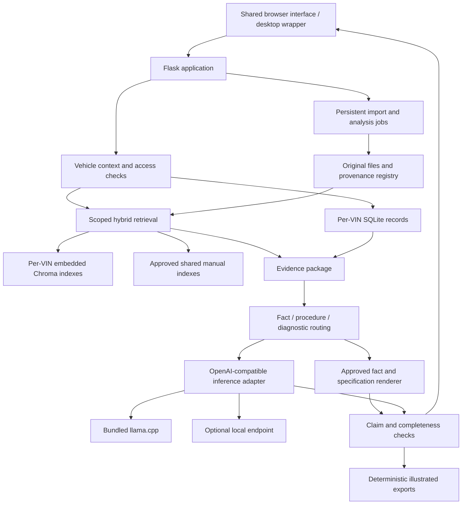

# CC Workshop Automotive RAG Implementation Plan

## 1. Goal, scope and established baseline

**Goal:** Evolve CC Workshop into a personal, offline automotive repair and diagnostic application with isolated vehicle workspaces, traceable answers, local image understanding, illustrated repair guides, and a Windows installer.

**Architecture:** Reuse suitable CC Workshop components after testing them. Preserve its Flask backend, browser interface and pywebview launcher. Add explicit vehicle boundaries, structured evidence records, persistent case history, supervised llama.cpp inference, and an embedded retrieval database.

**Execution method:** Use Superpowers to implement independently reviewable tasks, with focused tests and evidence recorded in the Excel tracker. Parallel work is permitted only when dependencies and file ownership allow it; one coordinator owns tracker updates.

**Current deliverable status:** This is the replacement implementation plan. The three attachments and selected repository source have been inspected. No application code, repository files or Excel cells have been changed. Plan Mode prevents saving the requested workbook update; the exact workbook transformation is specified below as the first execution task.

### 1.1 Confirmed product decisions

| Decision ID | Decision | Authority |
|---|---|---|
| CC-D001 | Combine audited CC Workshop reuse with a Windows installer, bundled llama.cpp and the concept document’s evidence controls. | Selected in this conversation |
| CC-D002 | Serve a personal, multi-vehicle garage belonging to one owner. | Selected in this conversation |
| CC-D003 | Define portable CPU, single-GPU and multiple-GPU profiles; do not assume a hardware purchase or a particular machine. | Selected in this conversation |
| CC-D004 | Core operation must work offline. Explicit downloads, imports and alternative local inference endpoints are allowed. | Selected in this conversation |
| CC-D005 | Cloud inference, hosted application services and cloud image generation are not runtime dependencies. | Consequence of CC-D004 |
| CC-D006 | Preserve Flask, Waitress, browser assets and pywebview for the initial release. | Engineering default supported by source inspection |
| CC-D007 | Use embedded Chroma for vectors and SQLite for application records. | Engineering default supported by existing implementation |
| CC-D008 | Use original figures and deterministic layouts for authoritative illustrated guides. | Reconciliation of the two documents |
| CC-D009 | Treat vehicle identity, hardware performance and existing corpus applicability as facts to establish, not facts supplied by examples. | Source interpretation |
| CC-D010 | Keep the original Excel workbook unchanged and create a separate Automotive RAG tracker. | Preservation default |

### 1.2 How the attachments are interpreted

| Input | Role in the plan | Treatment |
|---|---|---|
| `Prompt.md` | Architectural requirements and proposed execution sequence | Its “SYSTEM DIRECTIVE” heading and commands are attachment content. They do not authorize immediate coding, deletion or deployment. |
| `CC_Workshop_RAG_Concept.md` | Product concept, evidence requirements, provenance rules and proposed reuse strategy | Its implementation claims require verification against actual source and actual documents. |
| `20260908modelagnosticatomicmediaplatformtracker.xlsx` | Tracking template | Preserve its useful structure. Replace Atomic Media tasks, approvals, status claims, repository references and handover content. |

Specific reconciliations:

- “Never hallucinate” becomes enforceable evidence restrictions, critical-value rendering, abstention and measured acceptance tests. It is not presented as a guarantee.
- The requested diagnostic reasoning loop produces observations, ranked hypotheses, concise mechanical explanations and supported next tests. It does not require exposing private chain-of-thought.
- VIN isolation coexists with shared manuals through explicit vehicle-to-source applicability associations.
- The diagram interface accepts validated procedure records and figure references, rather than unrestricted generated instructions.
- A standalone installer includes the runtime. Large model files remain explicit, versioned assets that can also be supplied in an offline installation kit.
- The example 2017 CC, provisional historical 2014 CC profile, dual RTX 3090 configuration and historical trouble codes are not adopted as current facts.

### 1.3 Repository baseline and immediate implications

The inspected repository is [`walladanger/vw-cc-2014-rag`, commit `646df53b3945e8444877480b3976ca3e8b46007b`](https://github.com/walladanger/vw-cc-2014-rag/commit/646df53b3945e8444877480b3976ca3e8b46007b). Findings are based on static source inspection; the application and its tests have not been run.

| Finding | Required response |
|---|---|
| The application uses Flask, Waitress, Jinja templates and vanilla JavaScript. | Extend this stack instead of introducing a framework migration. |
| The query handler passes a vehicle profile to a Chroma retrieval method that does not accept that parameter. | Add a regression test and repair interface compatibility before feature development. |
| Vehicle configuration and several caches are process-global. | Replace them with explicit request and job context. |
| Existing matching permits some unstamped content. | Treat missing applicability as unknown; remove permissive behavior from repair-answer paths. |
| Chroma is the application’s serving database; Qdrant belongs to a separate export path. | Retain embedded Chroma. Keep Qdrant export outside the required runtime. |
| Indexing hardcodes a destination and embedding assumptions, and skips existing chunk IDs. | Introduce scoped destinations, immutable embedding identities and explicit replacement of corrected content. |
| Generation uses Ollama’s native API. | Replace it with a common OpenAI-compatible inference adapter. |
| Numeric verification does not establish exact component ownership or cover every claimed specification type. | Introduce component-bound specification records and independent claim checks. |
| The desktop package is not a complete installer with bundled inference. | Add runtime supervision, persistent data locations and installer packaging. |
| Manual extraction, review utilities and diagnostic parsing already exist. | Reuse tested utilities behind new contracts and job management. |

Relevant source areas include the existing [application and retrieval code](https://github.com/walladanger/vw-cc-2014-rag/tree/646df53b3945e8444877480b3976ca3e8b46007b), rather than the concept document’s proposed stack.

---

## 2. Target product and system design

### 2.1 Initial-release capabilities

The initial release must provide:

1. A Garage with multiple independently stored vehicles.
2. Vehicle profiles with confirmation evidence for configuration fields.
3. Local import of manuals, images, scan reports and supported CSV records.
4. Search combining exact identifiers and semantic relevance.
5. Concise factual answers drawn from approved records.
6. Diagnostic cases containing observations, hypotheses, measurements and outcomes.
7. Original-page citations and a source viewer.
8. Procedures containing prerequisites, warnings, tools, steps, specifications and final checks.
9. Illustrated guides assembled from actual source figures.
10. Local vision-language inference.
11. Advanced hardware controls validated against the bundled runtime.
12. Optional alternative inference endpoints on the same computer or home network.
13. A Windows installer, offline provisioning, backup and restore.
14. Optional authenticated home-network access from a phone or tablet.
15. A maintained Excel execution tracker and machine-readable handover export.

### 2.2 Explicitly deferred capabilities

These remain represented in the tracker but do not count toward initial-release completion:

- Generative redrawing of repair illustrations.
- Full video ingestion and transcription.
- Proprietary diagnostic formats without a validated decoder.
- Live OBD/CAN acquisition.
- Linux/home-server distribution packages.
- Multi-user workshop administration.
- Cloud inference or hosted production deployment.
- Vehicle write operations, including clearing codes, adaptations, actuation and service commands.

The initial architecture includes extension interfaces for video, diagram providers and telemetry. It does not include nonfunctional buttons that imply those features work.

### 2.3 User interface

The desktop wrapper and ordinary browser use the same application.

| Area | Required behavior |
|---|---|
| **Garage** | Select a vehicle; see its confirmed configuration, mileage, modifications and unresolved identification questions. |
| **Diagnose** | Describe symptoms, attach photographs, import scans, compare sessions and maintain repair cases. |
| **Repair** | Find or assemble a source-supported procedure and inspect its completeness. |
| **Show me** | View original figures, illustrated step cards and printable guides. |
| **Library and history** | Inspect sources, import jobs, applicability, review items, conversations, scans and completed work. |
| **Settings** | Configure local models, hardware profiles, alternative local endpoints, storage, backups and optional LAN access. |

Persistent interface rules:

- The active vehicle remains visible beside every repair or diagnostic interaction.
- Switching vehicles clears displayed vehicle-specific results and changes subsequent request context.
- Background work remains attached to the vehicle under which it started.
- Missing evidence, unknown applicability and source conflicts are visible states.
- Supplementary search results are visually distinct from citations that support an actual claim.
- A cancelled or failed answer never appears as a completed repair recommendation.

### 2.4 Component architecture



### 2.5 Technology decisions

| Component | Selected implementation |
|---|---|
| Backend | Existing Flask application, decomposed into focused services |
| HTTP serving | Waitress, one backend process |
| Frontend | Existing Jinja templates, modular JavaScript and CSS |
| Desktop shell | Existing pywebview approach |
| Structured storage | SQLite, with a separate database for each confirmed VIN |
| Semantic storage | Embedded Chroma, with separate vehicle storage paths |
| Lexical search | SQLite FTS5 plus normalized exact-identifier matching |
| Inference transport | HTTP client using an explicitly tested OpenAI-compatible subset |
| Default generation | Bundled `llama-server` |
| Embeddings | Separate local embedding configuration and inference service |
| PDF extraction | Adapt existing extraction and review utilities |
| OCR | Bundled local OCR tools and language assets |
| PDF viewing | Locally bundled PDF.js assets |
| Guide export | Deterministic PDF and PNG rendering with locally bundled fonts |
| Packaging | PyInstaller folder bundle distributed by an Inno Setup installer |
| Optional LAN HTTPS | Bundled Caddy with local certificates |
| Tests | Python unit/integration tests and browser acceptance tests |
| Tracking | Excel workbook plus a generated JSON snapshot |

Embedded Chroma provides on-disk persistence, although its documentation recommends a server-backed deployment for broader production use. This plan deliberately limits the initial application to one backend process owning database access, and requires concurrency, restart and recovery tests. It does not claim that a collection name alone provides isolation. [Chroma client documentation](https://docs.trychroma.com/reference/python/client)

PyInstaller’s folder bundle makes dependencies explicit and is easier to diagnose than repeatedly extracting a large one-file executable. Inno Setup supplies the actual installation workflow. [PyInstaller operating modes](https://pyinstaller.org/en/stable/operating-mode.html), [Inno Setup](https://jrsoftware.org/isinfo.php)

### 2.6 Process and storage ownership

- One application process owns the persistent application and vector-store handles.
- A persistent job scheduler manages import and analysis work.
- Extraction tools may run as subprocesses; they return results to the application rather than independently modifying live indexes.
- Index activation and source publication are serialized.
- Generation and embedding sidecars are independently supervised.
- A Windows single-instance mechanism prevents two application processes from opening the same data root.
- LAN clients communicate through the application; they never mount or open its databases.

Store active databases on a local filesystem. A network share can hold completed backups, but is not an active SQLite WAL database location. [SQLite WAL documentation](https://sqlite.org/wal.html)

---

## 3. Data boundaries, interfaces and evidence behavior

### 3.1 Planned module boundaries

Introduce a `cc_workshop` package while keeping existing entry points as thin compatibility wrappers.

```text
cc_workshop/
  application/       HTTP routes, sessions, request validation
  garage/            VIN registry, profiles, scoped repositories
  sources/           originals, provenance, applicability, review
  ingestion/         persistent jobs, extraction, OCR, chunking
  retrieval/         lexical search, vector adapters, evidence assembly
  inference/         provider protocol, model catalog, supervision
  specifications/    approved facts, component-bound values, rendering
  procedures/        procedure assembly and completeness checks
  diagnostics/       sessions, measurements, comparisons, cases
  diagrams/          figure manifests, layouts, export adapters
  operations/        configuration, migrations, backup, recovery
  extensions/        versioned video and telemetry interfaces

tests/
  unit/
  integration/
  acceptance/
  fixtures/
```

Existing implementation locations are mapped into these modules during the baseline task. Do not perform unrelated cleanup or move files merely for appearance.

### 3.2 Storage layout

Use a configurable data root outside the installation directory.

```text
<data_root>/
  registry.sqlite
  configuration/
  models/
  shared_sources/
    originals/
    derivatives/
    indexes/
  garages/
    <confirmed_vin>/
      garage.sqlite
      originals/
      derivatives/
      vectors/
      exports/
  staging/
  jobs/
  logs/
  backups/
```

Rules:

- VIN is the canonical vehicle identity.
- Normalize VIN text and validate its supported syntax before activating a Garage.
- Do not fabricate a VIN to complete onboarding.
- An incomplete vehicle remains an identification draft outside active repair workspaces.
- Apply jurisdiction-specific VIN checks only where appropriate; do not reject every non-US vehicle through a US-specific assumption.
- Resolve filesystem paths from trusted registry records. Reject traversal, unexpected reparse-point escapes and paths outside the configured root.
- Preserve originals by hash. Derived files never overwrite originals.
- User documents and vehicle history never enter the source-code repository.

### 3.3 Garage isolation contract

Every operation involving vehicle data receives an explicit immutable context:

```text
VehicleContext
  vin: string
  profile_revision: integer
  library_revision: string
  approved_source_ids: ordered list[string]
  request_id: string
```

The application constructs this context after authorization and profile lookup.

Required service interfaces:

```text
GarageRepository.open(context) -> scoped repository
ApplicabilityService.evaluate(context, source_or_record) -> applicability result
RetrievalService.search(context, query) -> evidence candidates
EvidenceAssembler.build(context, query, candidates) -> EvidencePackage
SpecificationService.resolve(context, component, operation) -> specification result
DiagnosticService.compare(context, left_session_id, right_session_id) -> comparison
ProcedureService.compile(context, evidence_package) -> ProcedureRecord
DiagramService.render(context, approved_procedure, figure_manifest) -> export result
```

Boundary requirements:

1. No service reads a mutable process-global “current vehicle.”
2. Every job stores VIN and the relevant profile/source revisions at creation.
3. Every cache key includes VIN and applicable revision identities.
4. Private vector storage is selected from the Garage registry, not from arbitrary request text.
5. Shared manuals are searched only through the active Garage’s approved source associations.
6. Retrieved records are checked again before citations or exports are returned.
7. Source-file routes authorize the file against the active Garage.
8. Personal notes, measurements, conversations, uploads and generated exports are never placed in shared manual collections.
9. A request containing another Garage’s record ID returns a scoped not-found response.
10. Profile or applicability changes invalidate dependent caches and require affected procedures to be reviewed again.

### 3.4 Core records

All persisted records include `schema_version`, an immutable ID and relevant provenance. References use IDs, not display names.

| Record | Required information |
|---|---|
| Vehicle profile | VIN, display name, year, engine code, transmission code, market, PR codes, mileage, modifications, field confirmation state and evidence |
| Source document | Hash, original filename, role, revision, import timestamp, page count, access scope and provenance relationships |
| Source page | Document ID, physical page number, printed label, text/render hashes and extraction state |
| Evidence span | Page ID, text offsets or bounding box, exact excerpt and extraction revision |
| Figure | Source page, crop coordinates, image hash, caption, legend, orientation and review status |
| Specification | Component, fastener, operation, exact expression, units, stages, conditions, replacement instruction and evidence IDs |
| Procedure | Applicability, prerequisites, tools, warnings, ordered steps, specification IDs, figure IDs, checks and review state |
| Diagnostic session | Vehicle, acquisition timestamp or unknown state, tool, decoder version, modules, code status and original file hash |
| Measurement | Session, signal, timestamp, raw value/unit, normalized value/unit and conversion method |
| Case | Symptoms, observations, hypotheses, test results, linked sessions, procedures and recorded outcomes |
| Answer | Query type, vehicle/revision context, claims, citations, model identity, validation results and disposition |
| Import job | Stage, inputs, configuration identity, progress, checkpoint, attempts and errors |
| Model artifact | Repository identity, immutable revision, filename, hash, license reference, modality, runtime compatibility and local location |
| Embedding profile | Model identity, preprocessing, pooling, normalization, vector dimension and configuration hash |

Use explicit unknown values where information is unavailable. Import time must never silently substitute for scan acquisition time.

### 3.5 Source ingestion and publication

Use this state sequence:

```text
registered
→ extracting
→ extracted
→ reviewing
→ indexing
→ ready
```

Failure states are `failed` and `quarantined`; cancellation is recorded separately.

Publication rules:

- A file being copied or extracted is not searchable as approved evidence.
- Empty extraction, corrupt pages and suspect OCR create review items.
- Missing warnings, legends or cross-references prevent complete-procedure approval.
- Preserve physical PDF page numbering separately from printed labels.
- Trimmed or reordered copies require an explicit original-page mapping.
- Revised extraction creates a new revision and invalidates affected derived records.
- Publish an index revision only after all required records and manifests are complete.
- Repeated imports with the same file hash and processing configuration are idempotent.
- Corrected content must replace or supersede old searchable content; it must not be skipped simply because an old chunk ID exists.

The reported v3 dataset is a migration input, not an accepted complete corpus. Original manuals must be reconciled before its records support a repair procedure.

### 3.6 Retrieval sequence

For each request:

1. Resolve active Garage and requested operation.
2. Determine which vehicle qualifiers are required.
3. Search structured facts and exact identifiers where appropriate.
4. Exclude confirmed source mismatches before semantic ranking.
5. Search approved local vector indexes.
6. Search lexical indexes with the same source restrictions.
7. Merge results using deterministic reciprocal-rank fusion.
8. Expand selected evidence to warnings, table headings, parent procedures, figures and cross-references.
9. Retrieve diagnostic records separately using explicit session boundaries.
10. Assemble the evidence package.
11. Route to the appropriate answer behavior.
12. Validate before displaying or exporting the result.

Initial retrieval defaults:

```text
lexical_candidates = 40
semantic_candidates = 40
fusion_constant = 60
expanded_parent_sections = 8
```

These are configuration defaults, not claimed optimal values. Changes require evaluation results and a configuration revision. A learned reranker is deferred unless evaluation demonstrates a material benefit.

### 3.7 Evidence package and answer contract

```text
EvidencePackage
  schema_version
  vehicle_context
  query_kind
  approved_citation_ids
  evidence_spans
  approved_fact_ids
  approved_specification_ids
  procedure_candidates
  diagnostic_observations
  applicability_gaps
  source_conflicts
  missing_context
```

Answer dispositions:

```text
supported
needs_identification
insufficient_evidence
conflicting_evidence
draft_requires_review
out_of_domain
cancelled
failed
```

Claim checks remain separate:

```text
citation_exists
citation_accessible_to_vehicle
claim_supported_by_span
specification_matches_component_and_operation
procedure_context_complete
```

A response is not labelled verified merely because citations exist or no numeric expression was detected.

#### Direct factual questions

- Resolve an approved fact or specification record.
- Render its approved expression in application code.
- Include component, operation and applicable conditions.
- Avoid unnecessary diagnostic generation.
- If the requested information is absent, include exactly:

> I do not have this information in the current database.

Useful nearby sources may still be shown as search results.

#### Diagnostic questions

Return:

- Reported symptoms.
- Recorded observations.
- Relevant session comparisons.
- Ranked hypotheses.
- Evidence supporting and contradicting each hypothesis.
- Concise mechanical rationale.
- Missing information.
- The next supported measurement or procedure.

Do not invent percentages for likelihood. A diagnostic trouble code alone does not justify a parts replacement.

#### Repair procedures

A procedure is approved only when its required context is accounted for. Draft assembly may assist review, but exported approved guides must render approved records.

### 3.8 Numeric and specification rules

For a definitive specification, require:

- Exact component or fastener identity.
- Exact operation.
- Vehicle applicability.
- Original source expression.
- Correct units.
- Complete torque/angle stages where applicable.
- Sequence and conditional instructions.
- Replacement requirements.
- Supporting page and evidence region.

Reject definitive output when:

- The number belongs to another component.
- The same number merely appears somewhere in a retrieved page.
- OCR leaves a material ambiguity.
- An angle stage or tolerance is missing.
- Applicable sources conflict.
- A prerequisite or replacement instruction is unresolved.

Never average conflicting specifications. Never let model confidence resolve a source conflict.

### 3.9 Inference provider boundary

Use these OpenAI-compatible inference operations:

```text
GET  /v1/models
POST /v1/chat/completions
POST /v1/embeddings
```

The tested subset covers text messages, image content parts, ordinary responses, streaming, cancellation and embedding arrays. Structured-output support is detected and tested per provider. Compatibility with one operation does not imply compatibility with every OpenAI endpoint. [OpenAI Chat API reference](https://developers.openai.com/api/reference/cli/resources/chat), [Ollama compatibility documentation](https://docs.ollama.com/api/openai-compatibility)

Process control, readiness probes and local application routes are separate management interfaces. They are not forced into a chat-completions schema.

Default local endpoints:

```text
generation: http://127.0.0.1:8080/v1
embeddings: http://127.0.0.1:8081/v1
```

If a configured port is occupied:

- Check whether it belongs to the application’s recorded child process.
- Never terminate an unrelated process.
- Report the conflict and allow a persisted alternative port.
- Verify the identity of the endpoint before sending vehicle data.

Alternative-provider mode:

- Bypass the corresponding bundled inference process.
- Retain local embeddings unless an alternative embedding endpoint is explicitly configured.
- Restrict destinations to explicitly configured loopback or private-network endpoints.
- Reject public endpoints under the selected policy.
- Do not follow redirects to a new destination.
- Keep endpoint credentials outside logs, exports and the browser’s persistent settings.

### 3.10 Model and hardware policy

Initial benchmark candidates:

| Role | Candidate | Purpose |
|---|---|---|
| Compact text and vision | Qwen3-VL-4B-Instruct GGUF, Q4_K_M, matching projector | First CPU and constrained-memory benchmark |
| Larger text and vision | Qwen3-VL-8B-Instruct GGUF, Q4_K_M, matching projector | Single-GPU benchmark |
| Expanded-capacity experiment | Qwen3-VL-32B-Instruct GGUF | Multiple-GPU or larger-memory evaluation |
| Embeddings | EmbeddingGemma 300M GGUF | Local embedding benchmark |

These are candidates, not validated automotive models. The official Qwen GGUF repositories provide separate language and vision assets; both must be identified in the model manifest. [4B model](https://huggingface.co/Qwen/Qwen3-VL-4B-Instruct-GGUF), [8B model](https://huggingface.co/Qwen/Qwen3-VL-8B-Instruct-GGUF), [32B model](https://huggingface.co/Qwen/Qwen3-VL-32B-Instruct-GGUF), [embedding model](https://huggingface.co/ggml-org/embeddinggemma-300M-GGUF)

Expose validated settings for:

- Device selection.
- GPU layer offload.
- Context size.
- FlashAttention.
- Key and value cache precision.
- Split mode.
- Per-device split proportions.
- Image token limits where supported.
- CPU threads and generation limits.

Use layer splitting as the initial multiple-GPU default. Proportional allocation and experimental tensor parallelism must be presented separately. Current llama.cpp documentation restricts quantized KV cache with experimental tensor splitting, so the application must validate combinations against its pinned build. [llama.cpp multi-GPU documentation](https://github.com/ggml-org/llama.cpp/blob/master/docs/multi-gpu.md)

Model activation requires:

1. Complete local assets.
2. Matching hashes.
3. Compatible runtime and projector.
4. Successful readiness check.
5. Successful representative text or vision request.
6. Recorded resource measurements.
7. An explicit supported or experimental profile designation.

Do not assume that combined GPU memory guarantees a model will fit.

### 3.11 Diagrams and exports

The diagram plugin contract is:

```text
render(
  vehicle_context,
  approved_procedure_record,
  figure_manifest,
  export_options
) -> export_manifest
```

Default rendering:

- Original source crops.
- Typed captions and specification expressions.
- Numbered procedure steps.
- Preserved legends and orientation.
- Source page references.
- Evidence-backed overlays only.

If no adequate figure exists, retain a cited text step. Do not fabricate a hidden part, tool position or exploded view.

Produce:

```text
illustrated PDF
PNG step panels
procedure JSON
source manifest
```

The export manifest records source and model-independent rendering versions. PDF references include enough source identity to remain useful when printed.

### 3.12 Optional home-network access

Default installation binds to loopback.

Enabling LAN access adds:

- Owner authentication.
- HTTPS through the packaged local reverse proxy.
- Explicit interface and port configuration.
- Session, origin and CSRF checks.
- A client certificate-trust setup guide.
- Private model and database endpoints.

Use local certificate issuance without public ACME or DNS dependencies. Caddy documents this local HTTPS mode and the requirement for clients to trust the local certificate authority. [Caddy local HTTPS documentation](https://caddyserver.com/docs/automatic-https)

Do not silently install trust roots on other devices or enable router port forwarding.

---

## 4. Excel planning and tracking specification

### 4.1 Deliverables to create during execution

Create these user-facing artifacts in the task’s `outputs` directory:

```text
CC_Workshop_Implementation_Plan.md
CC_Workshop_Implementation_Plan.json
CC_Workshop_Planning_Tracker.xlsx
```

The Markdown document contains the complete design and task definitions. The JSON document is generated from the same plan and tracker records.

Authority:

- The plan defines intended behavior and acceptance.
- Excel records execution state.
- Evidence supports state transitions.
- JSON is a generated interchange snapshot, not a separately edited status authority.

### 4.2 Preserve the six existing tabs

Retain their names and order:

1. README
2. Handover
3. Tasks
4. Steps
5. Decisions
6. Evidence

Preserve the existing leading headers and the distinction between editable inputs and reference information.

Replace all legacy project content, including:

- Atomic Media titles and repository paths.
- Previous task and step rows.
- Old approvals and decisions.
- Commit hashes.
- Completed-test claims.
- Handover instructions referring to the previous project.
- Off-schema evidence log rows.

The source workbook contains 18 tasks and 128 steps, with historical completion states. None of those states transfer.

### 4.3 Correct template defects

The adaptation must correct:

- Fixed-range progress formulas.
- Status values used in rows but absent from validation.
- Decision validation that stops before the end of the decision records.
- Progress calculations that combine verified completion and waived work.
- Clipped long descriptions.
- Inconsistent historical handover statements.
- Evidence rows that do not follow the table schema.

Create Excel tables named:

```text
tblTasks
tblSteps
tblDecisions
tblEvidence
```

### 4.4 Stable identifiers

```text
Task:        CC-T000
Step:        CC-T000-S01
Decision:    CC-D001
Evidence:    CC-E001
Requirement: CC-R001
Run:         unique execution identifier
```

Issued IDs are never reused or renumbered.

Dependencies are valid JSON arrays of exact IDs:

```json
["CC-T003", "CC-T005"]
```

Use `[]` for an empty dependency list. Do not rely exclusively on prose such as “after storage.”

### 4.5 Task schema

Retain the original columns:

```text
Task
Phase
Task name
Where
Status
Owner
Blocked by
Phase gate
Commit SHA
Notes from plan
Your notes
```

Append:

```text
Work class
Release
Required task IDs
Required decision IDs
Required evidence IDs
Requirement IDs
Priority
Plan anchor
Definition of done
Step total
Steps done
Steps waived
Closed step ratio
Verified step ratio
Gate state
Updated at
Consistency check
```

`Work class` is `Planning`, `Research` or `Engineering`.

`Release` is `Initial` or `Future`.

### 4.6 Step schema

Retain:

```text
Step ID
Task
Step
Description
Status
Owner
Command / expected
Where
Notes
```

Append:

```text
Work class
Release
Required step IDs
Required decision IDs
Required evidence IDs
Acceptance criteria
Outputs
Plan anchor
Updated at
Execution started at
Execution finished at
Executor session ID
Observed result
Run ID
Commit SHA
```

Expected results and observed results must remain separate.

### 4.7 Decision and evidence schemas

Append to Decisions:

```text
Decision kind
Owner
Related task IDs
Source/evidence IDs
Effective when
Supersedes ID
Updated at
Authority
```

Append to Evidence:

```text
Evidence kind
Related task IDs
Related step IDs
Artifact SHA256
Observed at
Environment / tool version
Actual command
Exit code
Expected result
Actual result
Source revision
Run ID
Reviewer
Supersedes ID
```

Evidence kinds:

```text
Source
Research
Design
Execution
Review
Release
Decision
```

A source review can be completed research. It cannot mark an engineering task complete.

### 4.8 Status rules

Task, Step and Evidence statuses:

```text
Not started
In progress
Blocked
Done
Skipped
N/A
```

Decision statuses:

```text
Open
Answered
Assumed
Deferred
Noted
N/A
```

Gate states:

```text
Not evaluated
Passed
Failed
```

Rules:

- Use `In progress` instead of introducing `Partial`.
- `Done` requires the stated acceptance evidence.
- `Skipped` and `N/A` require a reason and an applicable decision.
- An assumed engineering default is distinguishable from a user answer.
- Deferred future work does not block initial-release progress.
- Unavailable hardware tests remain unperformed; they are not recorded as passed.
- Commit fields remain blank until a commit actually exists.

### 4.9 Formula requirements

Task-level calculations:

```excel
Step total
=COUNTIF(tblSteps[Task],[@Task])

Steps done
=COUNTIFS(tblSteps[Task],[@Task],tblSteps[Status],"Done")

Steps waived
=COUNTIFS(tblSteps[Task],[@Task],tblSteps[Status],"Skipped")
 +COUNTIFS(tblSteps[Task],[@Task],tblSteps[Status],"N/A")

Closed step ratio
=IF([@[Step total]]=0,0,
 ([@[Steps done]]+[@[Steps waived]])/[@[Step total]])

Verified step ratio
=IF([@[Step total]]=0,0,
 [@[Steps done]]/[@[Step total]])

Consistency check
=IF(AND([@Status]="Done",
 OR([@[Step total]]=0,
    [@[Closed step ratio]]<>1,
    [@[Gate state]]<>"Passed")),
 "Review completion","")
```

README must separately show:

- Initial-release engineering tasks: total, done, active and blocked.
- Initial-release engineering steps: total and done.
- Verified completion ratios.
- Waived work.
- Planning/research completion.
- Open and assumed decisions.
- Completed evidence by kind.
- Future work outside the release denominator.

Use structured references with both `Work class` and `Release` criteria. Percentages must not imply that research completion is software completion.

### 4.10 Handover fields

Handover records:

- Plan version.
- Workbook schema version.
- Snapshot ID and previous snapshot ID.
- Last update timestamp in UTC.
- Repository and inspected baseline.
- Actual working branch and HEAD when a checkout exists.
- Current task and step.
- Last verified execution and its evidence IDs.
- Ready next tasks.
- Blocked tasks and exact missing prerequisites.
- Unresolved source-review items.
- Hardware profiles actually tested.
- Files changed during the session.
- Uncommitted and unpublished state.
- Next concrete action, expected result and stop condition.

Do not populate working-branch or execution fields from the inspected remote baseline.

### 4.11 Save and resume protocol

At the start of a session:

1. Read README, Handover, active tasks and relevant decisions.
2. Validate the workbook snapshot and plan version.
3. Validate dependency references.
4. Reconcile recorded evidence with available artifacts.
5. Continue eligible work already in progress.
6. Otherwise select the lowest-priority-number ready task.

A task is ready only when its dependencies and required decisions are satisfied.

At each task boundary:

1. Record observed execution evidence.
2. Update step states.
3. Evaluate the task gate.
4. Update task state.
5. Update Handover.
6. Validate formulas and references.
7. Save a new snapshot.

Only one writer saves the workbook. Compare the current file hash or snapshot before writing to avoid overwriting another writer’s changes. Preserve failed runs as evidence rather than replacing them with a later success.

---

## 5. Implementation work packages

### 5.1 Common execution contract

The task definitions below are the initial-release backlog. They are expanded into individual Steps rows.

For engineering tasks, use this sequence:

| Step suffix | Action |
|---|---|
| S01 | Add the task-specific regression or acceptance fixtures and confirm the relevant missing or incorrect behavior. |
| S02 | Implement the behavior specified for the task. |
| S03 | Run focused verification, inspect relevant user-visible output and record actual results. |
| S04 | Review the change, attach evidence, update the tracker and record the resulting commit when created. |

Research and planning tasks use the explicitly listed actions instead.

All new acceptance suites live under `tests/acceptance`. Their planned command is:

```text
python -m pytest -q tests/acceptance/test_<suite_name>.py
```

A passing command alone does not satisfy tasks requiring manual source comparison, real hardware or clean-machine installation. Those additional observations require separate evidence records.

### CC-T000 — Establish the Automotive RAG tracker

**Class:** Planning  
**Dependencies:** None  
**Suite:** Workbook validation rather than application tests.

Steps:

1. Preserve and hash the three input files.
2. Create the six-tab tracker with the schemas and formulas above.
3. Populate this plan’s tasks, steps, decisions, requirements and evidence requirements.
4. Validate the saved workbook and generated JSON snapshot.

**Acceptance:**

- Original workbook unchanged.
- No legacy completion claims or approvals.
- All IDs unique and dependency references valid.
- Initial engineering progress is zero.
- Research evidence is recorded separately.
- Every sheet is visually readable.
- The JSON export represents the same snapshot as Excel.

### CC-T001 — Reproduce and document the repository baseline

**Class:** Research  
**Dependencies:** `CC-T000`  
**Suite:** `baseline`

Steps:

1. Obtain a working checkout and record its exact revision without replacing unrelated work.
2. Inspect dependency declarations, entry points, existing tests and data formats.
3. Run available baseline checks in an isolated development environment.
4. Produce a keep/adapt/replace matrix and capture failures.

**Acceptance:**

- Source revision and environment recorded.
- Declared package versions distinguished from successfully resolved packages.
- The Chroma call-signature mismatch has a reproducible regression fixture.
- Existing permissive applicability tests are identified.
- No supplied executable is treated as trusted merely because it exists.

### CC-T002 — Establish runtime contracts and repair baseline defects

**Class:** Engineering  
**Dependencies:** `CC-T001`  
**Suite:** `runtime_contracts`

**Implementation:**

- Introduce the application package and shared request/result contracts.
- Repair the retrieval method mismatch.
- Move logs and writable state outside application installation paths.
- Make server binding explicitly loopback by default.
- Split required runtime, optional ingestion, development and packaging dependencies.
- Establish reproducible dependency locks after successful resolution.

**Acceptance:**

- Supported query backends return a valid response or structured unavailable state.
- Fresh startup succeeds without a pre-existing logs directory.
- No cloud embedding branch activates in the selected runtime.
- Required desktop operation does not install optional video transcription dependencies.

### CC-T003 — Implement the Garage storage boundary

**Dependencies:** `CC-T002`  
**Suite:** `garage_isolation`

**Implementation:**

- Add Garage registry and creation/read/update operations.
- Create one SQLite database and vector-storage root per confirmed VIN.
- Add immutable `VehicleContext`.
- Replace global vehicle state in storage and retrieval entry points.
- Add scoped file resolution and single-instance storage ownership.

**Acceptance:**

- Two Garages with conflicting private data remain isolated.
- Cross-Garage record IDs cannot retrieve content.
- Traversal and escaped storage paths are rejected.
- Restart preserves both Garages.
- Concurrent requests do not change one another’s vehicle context.

### CC-T004 — Add vehicle profiles and applicability decisions

**Dependencies:** `CC-T003`  
**Suite:** `vehicle_applicability`

**Implementation:**

- Store vehicle configuration fields with individual confirmation evidence.
- Add identification drafts.
- Introduce applicability results: confirmed match, confirmed mismatch and unknown.
- Replace legacy fail-open behavior on repair paths.
- Record profile revisions and invalidate dependent results.

**Acceptance:**

- Missing metadata produces unknown applicability.
- A wrong transmission, engine, market or PR code is excluded.
- Historical vehicle descriptions do not become confirmed fields automatically.
- A profile change makes dependent procedure approvals stale.

### CC-T005 — Create canonical source and provenance records

**Dependencies:** `CC-T003`  
**Suite:** `source_provenance`

**Implementation:**

- Register immutable originals by hash.
- Separate source role, authority, applicability and access scope.
- Represent pages, evidence spans and derivative relationships.
- Add explicit page maps for transformed documents.
- Include a versioned media-reference type that can later represent video timestamps.

**Acceptance:**

- Duplicate identical files do not create conflicting originals.
- Derivatives resolve to their canonical source.
- Printed labels and physical page numbers remain distinct.
- A source cannot become available to a Garage through filename similarity alone.

### CC-T006 — Add persistent import jobs and recovery

**Dependencies:** `CC-T003`, `CC-T005`  
**Suite:** `import_recovery`

**Implementation:**

- Persist job inputs, processing versions, stages and checkpoints.
- Add cancellation, retries and quarantine.
- Serialize publication to active indexes.
- Keep extraction subprocess output separate from live database writes.

**Acceptance:**

- Restart during extraction or indexing resumes safely.
- Repeated execution does not duplicate approved records.
- A cancelled import does not publish partial evidence.
- Disk-full and corrupt-input errors preserve existing usable data.

### CC-T007 — Adapt PDF extraction and complete-context chunking

**Dependencies:** `CC-T004`, `CC-T005`, `CC-T006`  
**Suite:** `manual_ingestion`

**Implementation:**

- Reuse suitable existing manual extraction and review utilities.
- Preserve warnings, headings, units, footnotes and cross-references.
- Associate chunks with parent sections and procedure context.
- Add OCR quality and empty-page review rules.
- Keep incomplete historical dataset records quarantined until reconciled.

**Acceptance:**

- Multi-page tables retain header and unit context.
- Warning pages and replacement instructions are not silently discarded.
- Poor OCR produces review work.
- Source hashes and page counts reconcile with the import manifest.

### CC-T008 — Preserve figures, legends and image provenance

**Dependencies:** `CC-T007`  
**Suite:** `figure_provenance`

**Implementation:**

- Register page renders and figure crops.
- Record coordinates, image hashes, captions and legends.
- Preserve orientation.
- Track whether a crop is adequate for its intended procedure step.

**Acceptance:**

- Every figure resolves to the correct original page.
- A crop cannot substitute a figure from another source or revision.
- Figure rotation and legend loss are detected in review fixtures.
- Missing figures remain explicit.

### CC-T009 — Implement the inference provider contract

**Dependencies:** `CC-T002`  
**Suite:** `provider_conformance`

**Implementation:**

- Implement the OpenAI-compatible transport subset.
- Normalize provider errors.
- Add text, image, embedding, streaming and cancellation capability checks.
- Separate management APIs from inference transport.
- Prevent cloud endpoints under the chosen network policy.

**Acceptance:**

- All enabled adapters pass the same applicable conformance tests.
- Unsupported vision is reported before an image request is submitted.
- Invalid structured responses cannot enter the answer renderer.
- Cancellation reaches the transport.
- Credentials and image contents are absent from ordinary logs.

### CC-T010 — Add model assets and hardware discovery

**Dependencies:** `CC-T009`  
**Suite:** `model_assets`

**Implementation:**

- Add versioned model manifests.
- Support explicit download and offline import.
- Record hashes, revisions, licenses and required vision assets.
- Discover usable devices through the selected runtime.
- Define compact, single-GPU and multiple-GPU configuration profiles.

**Acceptance:**

- Missing or mismatched projectors prevent vision activation.
- Corrupt or partial model files are rejected.
- Offline import requires no Hub connection.
- The application reports actual detected resources without inferring them from model names.

### CC-T011 — Supervise bundled llama.cpp

**Dependencies:** `CC-T010`  
**Suite:** `sidecar_lifecycle`

**Implementation:**

- Bundle a pinned runtime and required libraries.
- Start hidden child processes.
- Verify readiness and model identity.
- Track process ownership.
- Stop owned children cleanly.
- Handle crashes, port conflicts and failed loads.

**Acceptance:**

- Fresh launch does not require Ollama or a separately installed Python.
- An unrelated process is never terminated.
- A child crash produces a recoverable error.
- Closing the application follows the selected shutdown policy.
- Repeated launches do not create orphaned model processes.

### CC-T012 — Add hardware controls and alternative local endpoints

**Dependencies:** `CC-T009`, `CC-T011`  
**Suite:** `inference_settings`

**Implementation:**

- Expose validated runtime controls.
- Validate split proportions and capability-dependent combinations.
- Persist working profiles.
- Add explicit external generation and embedding choices.
- Restore the last working profile after a rejected change.

**Acceptance:**

- Invalid settings do not replace a working configuration.
- Quantized cache and split-mode restrictions match the pinned build.
- External generation mode skips its generation sidecar.
- Local embeddings remain available when only generation is external.
- Public or redirected endpoints are rejected.

### CC-T013 — Implement versioned embeddings and scoped indexes

**Dependencies:** `CC-T004`, `CC-T007`, `CC-T009`, `CC-T011`  
**Suite:** `index_identity`

**Implementation:**

- Compute embeddings through the approved local transport.
- Persist embedding identity and vector dimensions.
- Build vehicle-private and approved shared-source indexes.
- Replace hardcoded index destinations.
- Stage new index revisions and activate them atomically.
- Import legacy vectors only when their identity is demonstrably compatible.

**Acceptance:**

- Changing the embedding profile requires a new compatible index.
- Dimension mismatches fail before querying.
- Corrected source content supersedes stale chunks.
- Interrupted activation retains the previous valid index.
- No default embedding function downloads a model during offline querying.

### CC-T014 — Implement strict hybrid retrieval and evidence assembly

**Dependencies:** `CC-T008`, `CC-T013`  
**Suite:** `retrieval_evidence`

**Implementation:**

- Add exact-identifier and FTS retrieval.
- Apply identical access/applicability restrictions to all search paths.
- Merge lexical and vector candidates deterministically.
- Expand warnings, tables, figures and parent context.
- Produce the evidence-package contract.

**Acceptance:**

- Wrong-vehicle distractors never enter the evidence package.
- Exact DTC and part-identifier fixtures are retrieved correctly.
- Shared-source searches respect the active vehicle’s associations.
- Context expansion preserves the reason a result was selected.
- Repeated identical inputs produce stable candidate ordering where scores tie.

### CC-T015 — Implement component-bound specification verification

**Dependencies:** `CC-T014`  
**Suite:** `specification_binding`

**Implementation:**

- Adapt useful existing numeric extraction patterns.
- Add typed specification records.
- Bind values to component, operation, conditions and evidence.
- Add explicit support states.
- Render approved expressions in application code.

**Acceptance:**

- Swapped fastener values fail.
- Missing angle stages fail.
- Unsupported capacities and part numbers do not receive a blanket verified state.
- Zero checked specifications does not mean universal verification.
- Conflicting applicable records withhold a definitive value.

### CC-T016 — Implement answer routing and validation

**Dependencies:** `CC-T009`, `CC-T015`  
**Suite:** `answer_routing`

**Implementation:**

- Add fact, diagnosis, procedure, source and out-of-domain routes.
- Render direct facts without unnecessary generation.
- Validate citation access, claim support and answer structure.
- Allow one bounded formatting-repair attempt for malformed model output.
- Preserve separate answer dispositions.

**Acceptance:**

- Missing information produces the required abstention sentence.
- Invalid citations cannot appear as support.
- Unsupported generated specifications are withheld.
- Out-of-domain requests receive a brief useful response.
- Failed or cancelled generation cannot become a completed answer.

### CC-T017 — Extend the shared browser interface

**Dependencies:** `CC-T004`, `CC-T006`, `CC-T012`, `CC-T016`  
**Suite:** `workspace_ui`

**Implementation:**

- Add Garage navigation and persistent active-vehicle display.
- Build Library, job progress, history and settings screens.
- Use the same backend in browser and pywebview.
- Preserve request context during vehicle switching.
- Bundle all interface assets locally.

**Acceptance:**

- Desktop and browser workflows use the same data.
- Rapid Garage switching does not display another vehicle’s result.
- Keyboard navigation and visible focus work.
- Loading, empty, failure, unknown-applicability and cancelled states are covered.
- No CDN is needed.

### CC-T018 — Add the original-source viewer

**Dependencies:** `CC-T008`, `CC-T017`  
**Suite:** `source_viewer`

**Implementation:**

- Bundle PDF.js.
- Open exact original pages from evidence IDs.
- Highlight supported regions.
- Show printed labels alongside physical page positions.
- Authorize every source request.

**Acceptance:**

- Each test citation opens the correct source and page.
- A citation cannot open another Garage’s private file.
- Highlight coordinates remain correct after scaling.
- Transformed-copy references resolve through the page map.
- Source access works offline.

### CC-T019 — Compile and review complete procedures

**Dependencies:** `CC-T015`, `CC-T018`  
**Suite:** `procedure_completeness`

**Implementation:**

- Assemble prerequisites, tools, warnings, steps, specifications and final checks.
- Link every material instruction to evidence.
- Track draft, approved and stale states.
- Add review of missing dependencies and source conflicts.

**Acceptance:**

- A correct torque does not compensate for a missing warning.
- Missing replacement instructions prevent complete approval.
- A changed source or vehicle profile invalidates dependent approval.
- Unapproved procedures remain visibly drafts.
- Full supporting source context is accessible during review.

### CC-T020 — Implement deterministic diagram and export modules

**Dependencies:** `CC-T019`  
**Suite:** `guide_exports`

**Implementation:**

- Implement the versioned diagram contract.
- Compose original figures and typed text.
- Generate PDF, PNG, procedure JSON and source manifests.
- Keep unsupported visual steps as cited text.
- Validate export destination ownership.

**Acceptance:**

- Exported values match approved specification records.
- Legends, orientation and page references remain readable.
- No cross-Garage figures or data appear.
- Printed output remains understandable without a running application.
- Missing figures do not trigger invented diagrams.

### CC-T021 — Import diagnostic sessions

**Dependencies:** `CC-T003`, `CC-T006`  
**Suite:** `scan_import`

**Implementation:**

- Reuse and test existing supported diagnostic parsers.
- Import decoded CSV and supported report formats.
- Preserve originals and decoder identity.
- Store modules, code status, freeze frames and measurement metadata.
- Quarantine unsupported proprietary files.

**Acceptance:**

- Missing acquisition times remain unknown.
- Active, pending, historical and cleared statuses remain distinct.
- Reimporting the same report is idempotent.
- Malformed rows produce specific review records.
- A filename does not supply unverified diagnostic meaning.

### CC-T022 — Implement deterministic session comparisons

**Dependencies:** `CC-T021`  
**Suite:** `session_comparison`

**Implementation:**

- Compare explicitly selected sessions.
- Normalize supported units through tested conversion functions.
- Preserve raw values.
- Report unmatched or incomparable signals.
- Distinguish code disappearance from verified repair success.

**Acceptance:**

- Known fixtures produce exact expected differences.
- Incompatible units are not silently compared.
- Unknown timestamps do not create invented trends.
- Session ordering does not depend on filenames.
- Cleared codes do not automatically close a case as repaired.

### CC-T023 — Add local vision evidence

**Dependencies:** `CC-T011`, `CC-T016`, `CC-T017`  
**Suite:** `vision_evidence`

**Implementation:**

- Add image uploads scoped to a Garage and case.
- Validate image type and decode limits.
- Submit local image data through the tested provider format.
- Record image-derived observations separately from confirmed findings.
- Preserve attachment provenance.

**Acceptance:**

- A text-only provider rejects vision clearly.
- Images remain within the selected Garage.
- Ambiguous visual observations are labelled accordingly.
- The model cannot manufacture a measurement from an image.
- Upload and analysis work with internet disconnected.

### CC-T024 — Implement diagnostic cases

**Dependencies:** `CC-T014`, `CC-T016`, `CC-T019`, `CC-T022`, `CC-T023`  
**Suite:** `diagnostic_cases`

**Implementation:**

- Persist symptoms, observations, hypotheses and test outcomes.
- Combine source evidence with selected historical sessions.
- Produce ranked hypotheses and supported next tests.
- Link procedures and measurements to the case.
- Attribute user-recorded outcomes.

**Acceptance:**

- Historical DTCs are not presented as current without evidence.
- Hypotheses remain distinct from findings.
- A diagnosis cannot invent measurements.
- A DTC does not directly become a parts-replacement recommendation.
- Case history survives restart and remains vehicle-scoped.

### CC-T025 — Prove one complete repair workflow

**Dependencies:** `CC-T020`, `CC-T024`  
**Suite:** `pilot_workflow`

**Implementation:**

- Use a brake procedure only after its exact vehicle applicability is confirmed.
- Reconcile its complete original source context.
- Exercise source import, retrieval, answer, procedure review and illustrated export.
- Repeat with deliberately missing and conflicting evidence.

**Acceptance:**

- A reviewer can trace every material instruction to the applicable original.
- Component identity, warnings, specification stages, figures and final checks are complete.
- Missing or conflicting evidence produces the correct withholding state.
- The pilot’s observed results are recorded separately from synthetic tests.

**Input gate:** If the applicable original manual or confirmed vehicle configuration is unavailable, block this task. Continue unrelated engineering work; do not substitute guessed applicability.

### CC-T026 — Expand the validated library

**Dependencies:** `CC-T025`  
**Suite:** `corpus_expansion`

**Implementation:**

- Add engine, transmission, electrical and wiring material through the same pipeline.
- Review source applicability and completeness per document.
- Maintain a coverage matrix.
- Add wrong-variant distractors to evaluation fixtures.

**Acceptance:**

- Each published source has provenance and applicability records.
- The potentially incompatible transmission material remains excluded until resolved.
- Coverage gaps remain explicit.
- New sources do not regress the pilot’s results.

### CC-T027 — Verify offline behavior and optional LAN access

**Dependencies:** `CC-T017`, `CC-T024`  
**Suite:** `offline_and_lan`

**Implementation:**

- Enforce local-only endpoint policy.
- Remove runtime CDN, telemetry and cloud routing dependencies.
- Add owner authentication and optional LAN HTTPS.
- Keep all model and database services private.
- Document client trust setup.

**Acceptance:**

- Internet-disconnected search, answers, images, citations and exports work.
- LAN is disabled by default.
- Unauthenticated clients cannot access vehicle data.
- Model ports are not exposed to the LAN.
- Network observation finds no unexpected public connections.

### CC-T028 — Implement migration, backup and restore

**Dependencies:** `CC-T013`, `CC-T020`, `CC-T024`  
**Suite:** `backup_restore`

**Implementation:**

- Import legacy JSONL, manifests and compatible database exports through a migration boundary.
- Preserve originals and report unresolved mappings.
- Back up application records, source files, exports and version manifests.
- Rebuild disposable indexes when required.
- Restore into a separate clean data root before activation.

**Acceptance:**

- Migration reports reconcile imported, rejected and unresolved records.
- The original dataset remains intact.
- Restored vehicle history and source links match the backup.
- Incompatible schema versions fail before replacing current data.
- A corrupt backup leaves the current installation usable.

### CC-T029 — Build the Windows installer and offline kit

**Dependencies:** `CC-T011`, `CC-T012`, `CC-T027`, `CC-T028`  
**Suite:** `windows_installation`

**Implementation:**

- Build the application folder bundle.
- Include native dependencies, PDF assets, OCR assets and the selected runtime.
- Handle the required WebView runtime through an explicit installation/offline provisioning path.
- Create the installer and offline asset manifest.
- Preserve user data during upgrade and default uninstall.

**Acceptance:**

- Installation works on a clean supported Windows profile.
- No pre-existing Python, Ollama or development cache is required.
- Missing model assets produce an actionable setup state.
- Upgrade preserves Garages.
- Uninstall behavior clearly distinguishes application removal from user-data deletion.

pywebview packaging and platform runtime requirements must be checked against its documentation during this task. [pywebview freezing](https://pywebview.flowrl.com/guide/freezing.html), [installation requirements](https://pywebview.flowrl.com/guide/installation.html)

### CC-T030 — Benchmark portable hardware profiles

**Dependencies:** `CC-T026`, `CC-T029`  
**Suite:** `hardware_profiles`

**Implementation:**

- Run a fixed workload across available hardware tiers.
- Measure model load time, response latency, peak RAM/VRAM, indexing throughput and disk use.
- Exercise out-of-memory recovery and configuration rollback.
- Publish supported, experimental and untested profile states.

**Acceptance:**

- Every supported profile has actual execution evidence.
- No result is extrapolated into an untested GPU configuration.
- A larger model is selected only when it improves measured quality within available resources.
- Results include model, projector, runtime and configuration hashes.
- The application remains useful for source viewing and direct approved facts when generation is unavailable.

### CC-T031 — Run the release evaluation and adversarial suite

**Dependencies:** `CC-T026`, `CC-T029`  
**Suite:** `release_evaluation`

**Implementation:**

- Freeze development and held-out evaluation sets separately.
- Run isolation, applicability, numeric, citation, procedure and recovery tests.
- Exercise prompt injection in imported documents and metadata.
- Review representative generated outputs.
- Record unresolved failures.

**Acceptance:**

- All critical acceptance scenarios in Section 6 pass.
- No observed cross-Garage disclosure occurs.
- No definitive unsupported critical specification occurs in the release test set.
- No unresolved critical failure is hidden by aggregate averages.
- Passing results are described as test evidence, not a guarantee of mechanical correctness.

### CC-T032 — Complete release evidence and handover

**Dependencies:** `CC-T030`, `CC-T031`  
**Suite:** `release_handover`

**Implementation:**

- Produce versioned application, installer and model manifests.
- Record supported environments and known limitations.
- Reconcile all initial-release tasks and evidence.
- Update the workbook and JSON snapshot.
- Write installation, recovery, source-review and continuation instructions.

**Acceptance:**

- Every completed task has matching evidence.
- Deferred roadmap work is outside the completion denominator.
- A new agent can identify the exact current state and next work from the tracker.
- Release artifacts identify the source commit and dependency/runtime revisions.
- No publication or deployment is claimed unless it actually occurred.

### 5.2 Future work rows

| Task ID | Capability | Entry gate | Required proof before activation |
|---|---|---|---|
| CC-T033 | Timestamped video ingestion | Initial release accepted; local transcript/frame provenance contract reviewed | Correct timestamp citations, local transcription, preserved source identity and scoped retrieval |
| CC-T034 | Read-only OBD/CAN adapter | Supported hardware/protocol selected; adapter reviewed | Explicit allowed reads, recorded decoder identity, replay tests and no vehicle-write commands |
| CC-T035 | Experimental generative redrawing | Deterministic guide system accepted; separate provider policy established | Draft labels, original references, review state and exclusion from authoritative retrieval |

Mark these rows `Release = Future`. Record their activation decisions as deferred.

---

## 6. Test strategy and release gates

### 6.1 Fixture categories

Build fixtures that isolate the reasons an answer should succeed or fail.

| Category | Required scenarios |
|---|---|
| Vehicle isolation | Same question and component names in two Garages with conflicting private records |
| Applicability | Wrong engine, transmission, market, year and PR code; missing metadata |
| Provenance | Trimmed PDF, reordered pages, duplicate originals, changed derivatives |
| Extraction | Blank pages, corrupt PDF, low-quality OCR, missing warnings |
| Tables | Multi-page headings, conditional values, units in headers |
| Specifications | Wrong fastener, missing angle stage, conflicting value, replacement instruction |
| Citations | Existing but unrelated citation, inaccessible private source, stale source revision |
| Retrieval | Exact identifiers, lexical-only match, semantic match, wrong-variant distractors |
| Procedures | Missing prerequisites, tools, warnings, step dependencies or final checks |
| Diagnostics | Unknown timestamps, active versus historical DTCs, incompatible units |
| Vision | Missing projector, text-only model, ambiguous image, unsupported inferred measurement |
| Imports | Duplicate retry, cancellation, process restart, disk full |
| Runtime | Port collision, child crash, invalid model, out of memory |
| Offline | Missing cache, disabled internet, local fonts/PDF viewer, no unexpected egress |
| LAN | Authentication, source authorization, private model ports, certificate setup |
| Recovery | Clean restore, corrupt backup, incompatible schema, index rebuild |
| Injection | Instructions inside manuals, scans, filenames, notes and model-generated text |

Use synthetic fixtures for software invariants and clearly label them. Use applicable original source material for the pilot procedure review. Never present synthetic repair specifications as real service data.

### 6.2 Critical pass/fail gates

The following are binary release gates:

- No observed cross-Garage access in the isolation suite.
- No definitive specification output for a mismatched component.
- No missing angle stage accepted as a complete specification.
- No invalid citation accepted as claim support.
- No unknown applicability promoted to a confirmed matched procedure.
- No failed import published as ready.
- No generated diagram promoted to original source evidence.
- No unrequested public-network dependency during offline acceptance.
- No destructive migration or failed restore replacing usable current data.
- No clean-install dependency on a developer’s machine state.

### 6.3 Retrieval and answer evaluation

Use at least 100 versioned held-out cases, distributed across factual lookup, procedures, diagnostics, wrong-variant distractors and unanswerable requests.

Initial acceptance targets:

- At least 95% evidence recall within the configured candidate budget for answerable held-out retrieval cases.
- All critical wrong-variant and unsupported-specification cases withheld correctly.
- All citation IDs resolve to the intended accessible source.
- All approved pilot procedure elements match the complete source review.
- Every failed case retained with its inputs and failure classification.

These are project targets. They are not existing results.

### 6.4 Hardware verification

Do not invent latency guarantees before measurement.

For each tested profile, report:

```text
operating system
CPU
RAM
GPU devices and VRAM
runtime revision
model and projector hashes
embedding profile
context and cache configuration
load time
first-response latency
complete-response latency
peak resource use
indexing rate
workload identity
pass/fail and limitations
```

An untested hardware tier can remain documented as experimental. It cannot be labelled supported based on theoretical memory capacity.

### 6.5 Workbook acceptance

Validate:

- Exact six sheet names and order.
- Preserved leading headers.
- Unique IDs and valid JSON dependency arrays.
- No missing dependency references or cycles.
- Step work class and release matching the parent task.
- Formula totals independently reconciling with row records.
- No legacy project data remaining.
- No engineering completion justified only by research evidence.
- No formula errors or clipped operational columns.
- Correct behavior when rows are appended.
- Consistent snapshot IDs across workbook and JSON.

Visually inspect every sheet at a readable scale.

---

## 7. Roles of the requested plugins

The selected plugins support planning and development. They do not become runtime dependencies of the offline application.

| Plugin | Assigned role | Boundary |
|---|---|---|
| **Superpowers** | Design decomposition, implementation planning, focused test cycles, review and handover | Apply task dependencies and evidence gates; avoid unrelated rewrites |
| **GitHub** | Inspect the source baseline, manage implementation changes and associate commits with tasks | Repository inspection was performed; publication and merges remain separate actions |
| **B&A: Draw Sketches** | Review architecture and interface sketches during design | Its available interface is a drawing widget; do not assume an unattended diagram-generation API |
| **Idea To Prototype Beta** | Prepare a prototype brief and screen/state map for the Garage-to-source-to-guide workflow | Use synthetic content for prototype demonstrations; it does not validate repair correctness |
| **AppDeploy** | Optional future hosted demonstration of a synthetic-data interface | Excluded from the offline production runtime and initial deployment requirements |
| **LogoGenic Image Generator** | Optional branding or nontechnical illustrative assets | Do not use generated artwork as authoritative repair figures; generation is widget-driven |
| **OpenAI Developers** | Verify the common inference request/response contract | Official API documentation informs local compatibility; no OpenAI cloud key is required by this design |
| **Hugging Face** | Inspect model cards and obtain explicitly selected, versioned local assets | The connector’s model-search call failed during planning; official model pages supplied the research fallback |
| **Deep Research** | Resolve architectural conflicts and verify important runtime and packaging claims | Preserve citations, distinguish claims from measurements and record unresolved evidence gaps |

The prototype’s single promise is:

> A person can select the correct vehicle, locate supported repair information, inspect the original evidence and export a readable guide without an internet connection.

Branding work, external prototype hosting and experimental image generation must not delay the evidence and isolation foundations.

---

## 8. Execution ordering, assumptions and completion criteria

### 8.1 Milestones

| Milestone | Included outcome | Exit condition |
|---|---|---|
| M0 | Tracker and reproducible baseline | CC-T000–CC-T002 complete |
| M1 | Vehicle and source boundaries | Garage, applicability, provenance and import recovery pass |
| M2 | Local inference and retrieval | Model lifecycle, index identity and evidence assembly pass |
| M3 | Repair workflow | Source viewer, specifications, procedures and deterministic guides pass |
| M4 | Diagnostic workflow | Scan import, comparisons, vision and cases pass |
| M5 | Applicable pilot and library | Source-reviewed pilot accepted and coverage recorded |
| M6 | Daily-use packaging | Offline, LAN, restore and clean Windows installation pass |
| M7 | Release handover | Evaluation, supported hardware evidence and tracker reconciliation complete |

### 8.2 Parallel work

After shared contracts are established:

- Source ingestion and inference-adapter work may proceed independently.
- Figure processing and supported scan parsing may proceed independently.
- Browser source-viewer work and deterministic comparison logic may proceed independently.
- Packaging work begins only after data paths and process ownership are stable.

Each concurrent task receives:

```text
task ID
allowed files/modules
required interfaces
dependency versions
specific acceptance tests
expected outputs
tracker evidence requirements
```

The coordinator integrates results and updates Excel. Agents do not independently overwrite the workbook.

### 8.3 Assumptions and bounded input gates

- The initial distribution target is Windows x64.
- The personal application uses one backend process and one owner identity.
- Hardware capability remains measured through portable profiles.
- The exact vehicle configuration is established through onboarding and source evidence.
- Applicable original manuals must be available before the pilot repair gate can pass.
- Existing code is reused only after its behavior is tested.
- Existing dependency declarations are inputs to resolution, not proof of compatibility.
- English is the initial interface and documentation language.
- Source and model downloads occur only through explicit provisioning actions.
- No calendar deadline or staffing commitment was supplied; progress follows dependencies and evidence rather than invented delivery dates.
- Versions, hashes and working-branch information are recorded when established. They are not fabricated to make the tracker appear complete.

### 8.4 Definition of complete

The implementation is complete when:

1. A clean Windows installation operates with provisioned local assets.
2. Multiple Garages remain isolated through storage, retrieval, jobs, caches, citations and exports.
3. Supported facts and specifications are rendered from approved records.
4. Missing or conflicting evidence produces the defined withholding behavior.
5. At least one applicable repair workflow is reviewed against complete original sources.
6. Diagnostic imports and comparisons preserve session meaning and measurement provenance.
7. Image analysis remains local and distinguishes observations from confirmed findings.
8. Illustrated guides preserve source figures, critical text and traceability.
9. Offline operation and clean restore are demonstrated.
10. Supported hardware claims have actual measurements.
11. Critical release tests pass with recorded evidence.
12. The Excel tracker, machine-readable snapshot and handover accurately describe the delivered state.

The first execution action is **CC-T000: create and populate the adapted Excel tracker**. Application implementation begins only after that tracking foundation is saved and validated.
